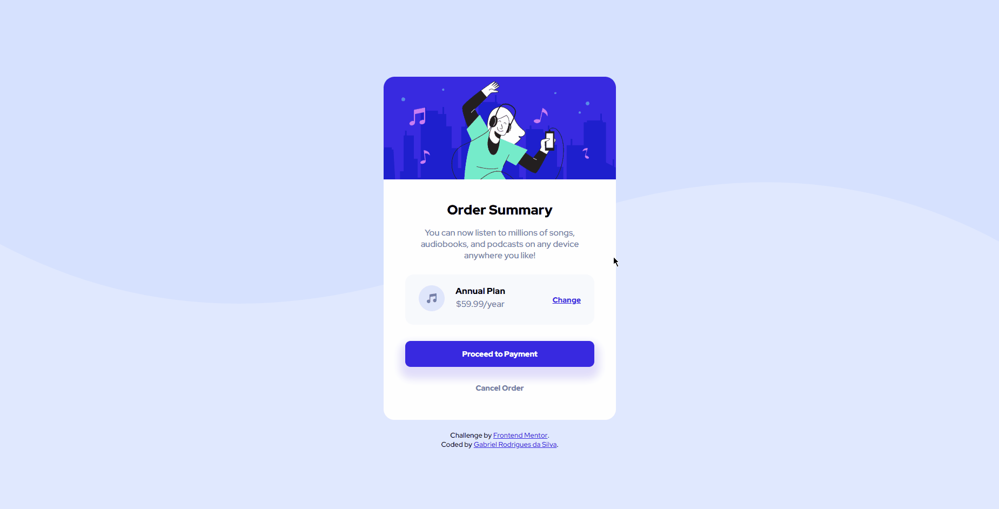

# Frontend Mentor - Order summary card solution

This is a solution to the [Order summary card challenge on Frontend Mentor](https://www.frontendmentor.io/challenges/order-summary-component-QlPmajDUj). Frontend Mentor challenges help you improve your coding skills by building realistic projects. 

## Table of contents

- [Overview](#overview)
  - [The challenge](#the-challenge)
  - [Screenshot](#screenshot)
  - [Links](#links)
- [My process](#my-process)
  - [Built with](#built-with)
  - [What I learned](#what-i-learned)
- [Author](#author)
- [Acknowledgments](#acknowledgments)

**Note: Delete this note and update the table of contents based on what sections you keep.**

## Overview

### The challenge

Users should be able to:

- See hover states for interactive elements

### Screenshot
 

### Desktop 

### Mobile

### Links

- Solution URL: [Lobby with all my solutions for Front-End Mentor's Challenges](https://graben-el.github.io/Front-End-Mentor-Challenges/)
- Live Site URL: [Order summary card solution](https://graben-el.github.io/Front-End-Mentor-Challenges/Order%20Summary%20Component%20Main/index.html)

## My process

### Built with

- Semantic HTML5 markup
- CSS custom properties
- Flexbox

### What I learned

Just reforcing the uses of flexbox, adaptative width and other properties.

## Author

- Website - [Gabriel Rodrigues da Silva](https://github.com/Graben-el?tab=repositories)
- Frontend Mentor - [@Graben-el](https://www.frontendmentor.io/profile/Graben-el)
- Twitter - [@gabriel_ukisuke](https://twitter.com/gabriel_ukisuke)

## Acknowledgments

Cheers to DevEmDobro team/community. I've learnt a lot of things in just a few weeks of course. 