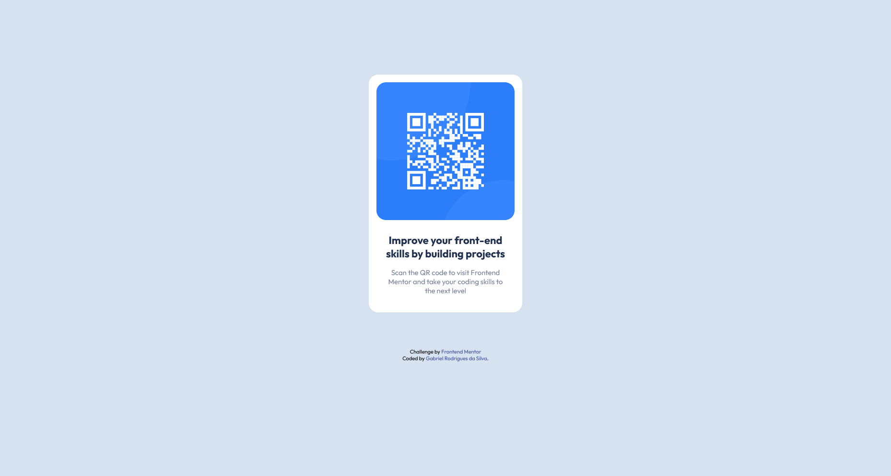

# Frontend Mentor - QR code component solution

This is a solution to the [QR code component challenge on Frontend Mentor](https://www.frontendmentor.io/challenges/qr-code-component-iux_sIO_H). Frontend Mentor challenges help you improve your coding skills by building realistic projects. 

## Table of contents

- [Overview](#overview)
  - [Screenshot](#screenshot)
  - [Links](#links)
- [My process](#my-process)
  - [Built with](#built-with)
  - [What I learned](#what-i-learned)
- [Author](#author)
- [Acknowledgments](#acknowledgments)

## Overview

### Screenshot




### Links

- Solution URL: [Lobby with all my solutions for Front-End Mentor's Challenges](https://your-solution-url.com)
- Live Site URL: [QR Code Card Challenge](https://your-live-site-url.com)

## My process

### Built with

- Semantic HTML5 markup
- CSS custom properties
- Flexbox

### What I learned

During this challenge I could finally find a way to center vertically elements using flexbox, while the container is inside the body tag. 

```css
body {
    display: flex;
    flex-direction: column;
    justify-content: center;
    align-items: center;
    height: 100vh;
    background-color: var(--body-bg-color);
}
```

For some reason, that I still don't understand, the body tag won't center things vertically as expected, even when height is set in an absolute value. But it works with the 100vh, which takes all the available view-port as height value.

I know that it isn't the best way to do it, though. More experienced people told me that the way I did it (by using height: 100vh) can cause some issues on lower resolutions, like on smartphones.

## Author

- Website - [Gabriel Rodrigues da Silva](https://github.com/Graben-el?tab=repositories)
- Frontend Mentor - [@Graben-el](https://www.frontendmentor.io/profile/Graben-el)
- Twitter - [@gabriel_ukisuke](https://twitter.com/gabriel_ukisuke)


## Acknowledgments

Cheers to DevEmDobro team/community. I've learnt a lot of things in just a few weeks of course. 