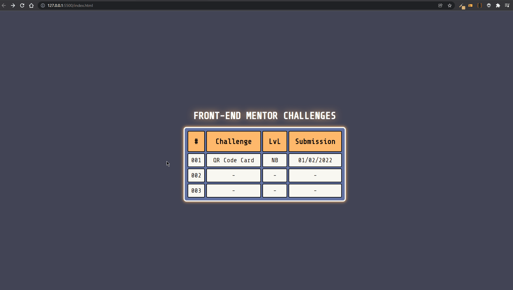

# Front-end Mentor Challenges

<section style="font-size: 20px;">
List of my solutions for <a href="https://www.frontendmentor.io/challenges" target="_blank" style="color: tomato;">Front-end Mentor's</a> challenges ( submission --> mm/dd/yyyy ).   

 ## Author

- Website - [Gabriel Rodrigues da Silva](https://github.com/Graben-el?tab=repositories)
- Frontend Mentor - [@Graben-el](https://www.frontendmentor.io/profile/Graben-el)
- Twitter - [@gabriel_ukisuke](https://twitter.com/gabriel_ukisuke)

( Github Pages: <a href="#" target="_blank" style="color: tomato;">https://graben-el.github.io/Front-End-Mentor-Challenges/</a> )
</section>

<!-- | # | Challenge | Submission |
| :---:   | :-: | :-: |
| 001 | <a href="#" target="_blank">QR Code Card</a> | 02/01/2022 |
|  |  | | -->
