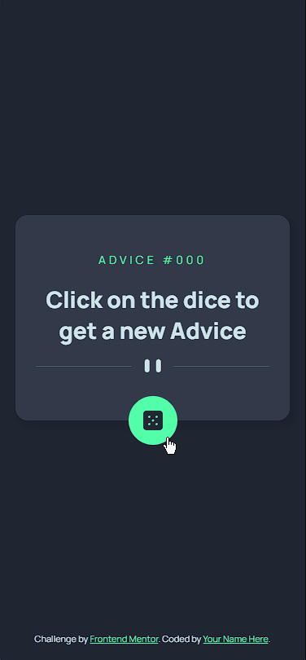

# Frontend Mentor - Advice generator app solution

This is a solution to the [Advice generator app challenge on Frontend Mentor](https://www.frontendmentor.io/challenges/advice-generator-app-QdUG-13db). Frontend Mentor challenges help you improve your coding skills by building realistic projects.

## Table of contents

- [Overview](#overview)
  - [The challenge](#the-challenge)
  - [Screenshot](#screenshot)
  - [Links](#links)
- [My process](#my-process)
  - [Built with](#built-with)
  - [What I learned](#what-i-learned)
- [Author](#author)
- [Acknowledgments](#acknowledgments)

## Overview

### The challenge

Users should be able to:

- Obtain an advice  and its ID by clicking on the dice button
- View the optimal layout depending on their device's screen size
- See hover states for interactive elements

### Screenshot
.

#### Desktop Version (2560x1080p)

#### Mobile Version

### Links

- Solution URL: [Lobby with all my solutions for Front-End Mentor's Challenges](https://graben-el.github.io/Front-End-Mentor-Challenges/)
- Live Site URL: [Advice generator app challenge on Frontend Mentor](https://graben-el.github.io/Front-End-Mentor-Challenges/advice-generator-app-main/index.html)

## My process

### Built with

- Semantic HTML5 markup
- CSS custom properties
- SASS pre-processor
- SASS partials
- Flexbox
- API implementation (Advice Slip JSON API)
- JavaScript modules

### What I learned

  It was a very interesting challenge to practice API uses with Javascript with async functions. I tried using React.JS on it, but it's such a small project that it turns out React was becoming an overkill tool.
    
  For the first time I had the opportunity to use the value "fit-content" for height properties, the best solution to layouts where the size of containers should adapt the content size.

### Continued development

I feel compeled to try implementing a translation API and make this app available in my language (portuguese). I'm also looking forward to add a "Light mode" button.

### Useful resources

- [Advice Slip JSON API](https://api.adviceslip.com/) -> API used to generate Advices

  ## Author

  - Website - [Gabriel Rodrigues da Silva](https://github.com/Graben-el?tab=repositories)
  - Frontend Mentor - [@Graben-el](https://www.frontendmentor.io/profile/Graben-el)
  - Linkedin - [Gabriel Rodrigues da Silva](https://www.linkedin.com/in/gabriel-rodrigues-da-silva-966163231/)
  - Twitter - [@gabriel_ukisuke](https://twitter.com/gabriel_ukisuke)

  ## Acknowledgments

  Cheers to DevEmDobro team/community. I've learnt a lot of things in just a few weeks of course. 
