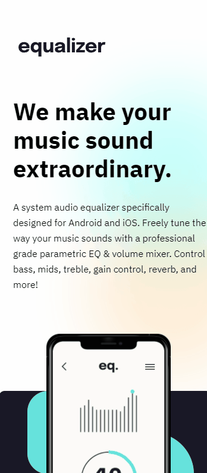

# Frontend Mentor - Equalizer landing page solution

This is a solution to the [Equalizer landing page challenge on Frontend Mentor](https://www.frontendmentor.io/challenges/equalizer-landing-page-7VJ4gp3DE). Frontend Mentor challenges help you improve your coding skills by building realistic projects. 

## Table of contents

- [Overview](#overview)
  - [The challenge](#the-challenge)
  - [Screenshot](#screenshot)
  - [Links](#links)
- [My process](#my-process)
  - [Built with](#built-with)
  - [What I learned](#what-i-learned)
- [Author](#author)
- [Acknowledgments](#acknowledgments)

## Overview

### The challenge

Users should be able to:

- View the optimal layout depending on their device's screen size
- See hover states for interactive elements

## Screenshot

Desktop Layout

Tablet Layout

Mobile Layout

### Links

- Solution URL: [Lobby with all my solutions for Front-End Mentor's Challenges](https://graben-el.github.io/Front-End-Mentor-Challenges/)
- Live Site URL: [Equalizer landing page solution](...)

## My process

### Built with

- Semantic HTML5 markup
- CSS custom properties
- Icons inserted with pseudo-elements
- Position
- Flexbox

### What I learned

This challenge gave me the opportunity to practice position properties, mixed with flexbox to organize items inside containers. 

I also learned the shorthand property "overflow", which we can use to make elements overlap its container by setting the value "visible". It was used to make the smartphone and premium section to overlap the background div.

Making the responsive versions of the desktop layout was kinda...annoying. I'm used to use flexbox and grid layouts that helps a lot with responsive designs. Using positions, a lot more have to be done to set the elements the way they're supposed to be.

## Author

- Website - [Gabriel Rodrigues da Silva](https://github.com/Graben-el?tab=repositories)
- Frontend Mentor - [@Graben-el](https://www.frontendmentor.io/profile/Graben-el)
- Twitter - [@gabriel_ukisuke](https://twitter.com/gabriel_ukisuke)
- LinkedIn - [Gabriel Rodrigues da Silva](https://www.linkedin.com/in/gabriel-rodrigues-da-silva-966163231/)

## Acknowledgments

Cheers to DevEmDobro team/community. I've learnt a lot of things in just a few weeks of course. 
